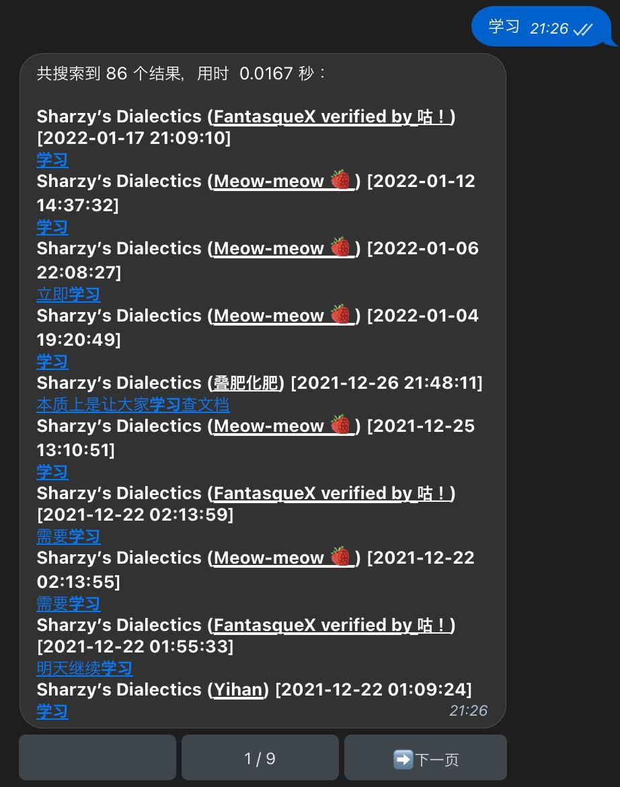

# TG Searcher

众所周知，Telegram 的搜索功能较弱，尤其是对于中文等 CJK 语言，由于 Telegram 无法对其进行正确的分词，因此很难搜到想要的内容。本项目实现了一个通用的框架，用户可以对 Telegram 的会话建立索引，通过 bot 来便捷地搜索消息。

它的使用效果见下图：

## 用法
关于如何运行和部署 Searcher，参见 [deploy.md](./doc/deploy.md)

关于如何编写配置，参见 [configuration.md](./doc/configuration.md)

关于不同版本的修改记录，参见 [CHANGELOG.md](./CHANGELOG.md)

## Telegram Bot 前端

Telegram Bot 的前端提供了如下功能：

当用户给 bot 发送消息的时候，bot 默认会将消息的内容视为搜索的关键词，因此会返回根据这个关键词进行搜索的结果。除了简单的关键词查询以外，还支持如下的高级搜索语法

1. `"foo bar"` 搜索出现 `foo bar` 这个字符串的消息
2. `AND`, `OR`, `NOT` 可以用来组合搜索逻辑，例如 `NOT foo AND (bar OR woo)` 搜索所有没有出现 `foo`，并且出现了 `bar` 或者 `woo` 的消息
3. `*` 和 `?` 通配符，前者匹配任意多个字符，后者匹配一个字符。注意：包含通配符的搜索会较慢。
4. 更详细的语法介绍，参见 whoosh 的[文档](https://whoosh.readthedocs.io/en/latest/querylang.html)

下面几条命令任何用户都可以使用：

1. `/search [keyword]`: 搜索消息，同去掉 `/search` 的情形等价。
2. `/chats [keyword]`: 列出所有被索引的，标题中包含 `keyword` 的会话列表。如果没有指定 `keyword`，则返回所有的会话。bot 会返回一列按钮，点击一个按钮之后这条消息就对应了一个会话。有一些指令包含 `chat_id` 作为参数，对于这些指令，如果没有指定 chat_id 参数，那么可以通过回复这条消息来把会话的 ID 当作参数。如果回复搜索的关键词，则只搜索这个会话中的消息。
3. `/random`：返回一条随机的消息（暂不支持指定会话）

下面几条命令只有管理员可以使用：

1. `/download_history [--max=MAX] [--min=MIN] [CHAT...]`: 下载某个会话的历史消息并将其进行索引。其中 `CHAT` 是对话的 id 或者用户名。如果没有指定 `CHAT` 也没有通过回复 bot 的消息来指定会话。`MIN` 和 `MAX` 参数用于指定索引的消息的最小和最大 ID。在下载之后，会话会自动加入监听列表，所有新消息和旧消息的修改、删除均会被同步到索引
2. `/monitor_chat CHAT...`: 仅将会话加入监听列表，不索引历史消息。注意：当前版本当后端重启之后，如果一个聊天没有任何消息被索引，那么它不会被加入监听列表，未来的版本可能会修复这个问题
3. `/stat`: 报告后端的状态
4. `/clear [CHAT...]`: 或者清除特定会话的索引，如果要清除所有索引，请使用 `\clear all`
5. `/find_chat_id KEYWORD`: 列出所有后端的账号的所有会话中包含 `keyword` 的会话以及对应的 id
6. `/refresh_chat_names`: 刷新会话 id 和会话名称之间映射的缓存
